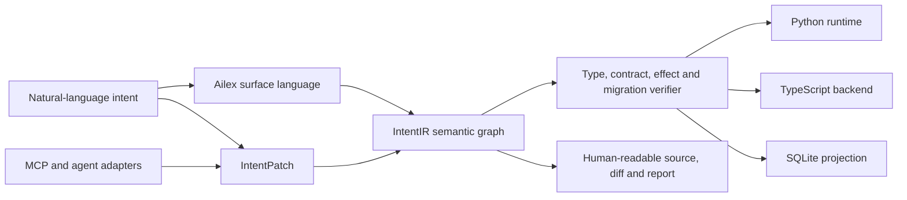

# IntentIRを世界で注目される成果にするための調査と実行計画

- 調査日: 2026-07-16
- 対象: [oyasumiholiday/ailex](https://github.com/oyasumiholiday/ailex) のAilex表層言語とroot IntentIR意味層
- 現在地: Ailex v0.5.3、IntentIR v0.14 Draft PR #3
- 調査方法: 現行コードと公開状態の監査、一次資料・公式仕様・査読論文との比較

> **2026-07-21更新:** 第一の外部目標をICSE 2027 Tool Demonstration and Data Showcaseに確定しました。現在はIntentPatch v0.13とAgent/MCP接続v0.14まで実装済みです。公式要件に合わせた最新の締切、Artifact、Paper、Video、評価計画は [ICSE_2027_DEMO_SUBMISSION_PLAN_JA.md](ICSE_2027_DEMO_SUBMISSION_PLAN_JA.md) を正とします。

## 結論

IntentIRは、すでに「動くアイデア」の段階には到達しています。しかし、世界で注目されるために必要な「既存方式より何がどれだけ良いか」という比較証拠がまだありません。

次に進むべき方向は、GoやPythonの機能を追いかけることではありません。中核を次の一点へ絞るべきです。

> **LLMの編集を、行ベースの文字列差分ではなく、内容ハッシュを前提条件に持つ型付き・検証義務付きの意味Patchとして実行する。**

世界向けの研究質問は次です。

> **Hash-guarded, obligation-aware semantic patchesは、LLMによる長期的なソフトウェア変更の正確性、安全性、修復コストを改善するか。**

概念だけでは注目されません。`IntentPatch`の実装、再現可能な比較ベンチマーク、英語論文、1コマンドで動く公開Artifactの4点が揃って、初めて世界へ出せる状態になります。

## 現在地

世界的な成果になるまでを5段階に分けると、現在は**段階2**です。

| 段階 | 状態 | 現在 |
|---|---|---|
| 1 | アイデアと設計文書がある | 完了 |
| 2 | 実行可能なPrototypeがある | 完了 |
| 3 | 比較実験と再現可能Artifactがある | 未達 |
| 4 | 第三者の利用・再現・論文採択がある | 未達 |
| 5 | 他のAgentや言語基盤が方式を採用する | 未達 |

### すでに強いもの

- Ailexは、モデルの生成傾向を測って言語仕様を変更する開発ループを持つ
- Ailex本体の適合テストは89 / 89成功
- IntentIRは内容アドレス付きGraph、契約、CRUD、Migration、Module、Relation、Capabilityを実行できる
- IntentIRの自動テストは66 / 66成功
- Python実行器、TypeScript生成、SQLite投影を同じ意味IRから扱う
- 否定的な実験結果や主張の下方修正も文書へ残している

### 公開面の不足

2026-07-16時点のGitHub公開状態は次のとおりです。以下は当時のSnapshotであり、CI追加、IntentIRのroot昇格、Security Policy、README Version整合は2026-07-21のv0.14 Draft PR #3で解消済みです。

- Repository作成から約3日
- 0 stars、0 forks
- 正式Releaseなし
- Ailex / IntentIRを検証する通常のGitHub Actions CIなし
- IntentIRは`experimental/intentir`配下
- IntentIR v0.12はDraft PRで、まだ`main`へ未統合
- `CONTRIBUTING.md`、`CITATION.cff`、Security Policy、再現用Containerがない
- AilexのPackage versionは0.5.3だがREADME本文は0.5.2で、公開情報に小さな不整合がある

これは技術不足というより、第三者が「30秒で試す」「同じ結果を再現する」「引用する」ための入口不足です。

## 先行研究との位置関係

### 既に他が達成しているもの

| 領域 | 代表例 | IntentIRへの含意 |
|---|---|---|
| 拡張可能な多段IR | [MLIR](https://arxiv.org/abs/2002.11054) | 多段IRやDialect自体は新規性にならない |
| 内容アドレス付きCode | [Unison](https://www.unison-lang.org/) | 内容HashでCodeを識別すること自体は新しくない |
| 型付きHoleとLLM Context | [Hazel / ChatLSP](https://doi.org/10.1145/3689728) | 型・ScopeをLLMへ渡す効果は既に実証されている |
| Semantic Patch | [Coccinelle](https://coccinelle.gitlabpages.inria.fr/website/) | 行差分でない意味Patch自体も既存概念である |
| Agent用Interface | [SWE-agent](https://arxiv.org/abs/2405.15793) | モデルだけでなくAgent Computer Interfaceが性能を左右する |
| 構造単位のLLM Edit | [BlockDiff / FuncDiff / AdaEdit](https://arxiv.org/abs/2604.27296) | 関数・Block単位編集より強い比較結果が必要になる |
| 長期反復でのCode劣化 | [SlopCodeBench](https://arxiv.org/abs/2603.24755) | 単発生成ではなく、変更を積み重ねる評価が必要になる |
| 汚染耐性のあるSWE評価 | [SWE-bench-Live](https://arxiv.org/abs/2505.23419) | 公開済みの固定問題だけでは評価の信頼性が弱い |
| AgentとToolの標準接続 | [MCP Architecture](https://modelcontextprotocol.io/docs/learn/architecture) | IntentIRを既存Agentへ接続する現実的な入口になる |
| 明示Capability | [WASI Capabilities](https://github.com/WebAssembly/WASI/blob/main/docs/Capabilities.md) | Capability Injection単独では新規性にならない |

Hazelの研究は、型とBinding構造をLLMへ直接渡すことが、低資源言語でも生成を大きく助けうることを示しました。SWE-agentも、Agent向けInterfaceの設計が結果を変えることを示しています。この2本はIntentIRの方向を支持しますが、同時に「型付きContext」だけでは新規性が足りないことも意味します。

2026年のBlockDiff / FuncDiff研究は、構文的にまとまった単位を編集することで、Full Code生成と同等の精度を保ちながら長いCode編集のLatencyとCostを30%以上減らしたと報告しています。したがって、IntentPatchはUnified Diffだけでなく、この構造単位編集もBaselineに含める必要があります。

SlopCodeBenchは、36問題・196 Checkpointの反復変更で、評価したAgentがEnd-to-Endで完全解決できず、構造劣化と冗長化が多くのTrajectoryで増えたと報告しています。これは、IntentIRの契約・依存Graph・変更影響範囲が価値を示せる有力な問題設定です。

### 主張してはいけないこと

- 「世界初の内容アドレス付き言語」
- 「世界初のAI向けIR」
- 「世界初のSemantic Patch」
- 「世界初の型付きHole」
- 「世界初のCapability Injection」
- 「JSONや機械可読形式だからLLMに効く」
- 「16タスクで100%なので一般的にPythonより優れている」

Ailex自身のQ1b実験でも、効いたのは構造化形式ではなく、Scopeと型という情報内容でした。この否定的結果は弱点ではなく、誠実な研究姿勢として前面に出せます。

## 残っている勝ち筋

個々の部品ではなく、次の統合と実証が新規性候補です。

1. 内容Hashを楽観的並行制御として使うAI編集Protocol
2. Node単位の型付きPatchと依存Edge更新
3. Patch適用前後の検証義務と影響範囲の自動計算
4. 古い状態を前提にしたAgent編集の決定的拒否
5. 同じPatchから複数Backendと人間向けDiffを生成
6. 長期反復変更における正確性・Cost・構造劣化の比較評価

推奨する世界向け説明は次です。

> **IntentIR is a model-independent semantic edit runtime that turns AI-generated changes into hash-guarded, typed, verifiable transactions.**

日本語では次のように説明できます。

> **IntentIRは、AIが生成した変更を、内容Hashで保護された型付き・検証可能なTransactionとして扱う、モデル非依存の意味編集Runtimeです。**

## 製品構成を一本化する

現在はAilex言語とIntentIRが別々のProjectのように見えます。世界へ出すときは、次の一つのSystemとして説明します。



- **Ailex**: AIと人間が書く表層言語
- **IntentIR**: 意味と依存関係の正本
- **IntentPatch**: AIが変更を提案するProtocol
- **Verifier**: Patchを確定してよいか判断する境界
- **Adapters**: Codex、Claude Code、OpenHands、SWE-agentなどとの接続

## 次に実装するv0.13

> 実装状況 2026-07-21: 以下のPatch Envelope、7 Operation、Hash Guard、原子的検証、影響解析、決定的ID、CLI dry-run/明示適用を実装済みです。73件の自動テストが通過しています。次のGateはAgent接続と比較Benchmarkです。

### Patch Envelope

最小形は次のようにします。

```json
{
  "schemaVersion": "0.13.0",
  "baseModuleId": "sha256:...",
  "operations": [
    {
      "kind": "replace_definition",
      "target": "action:CreateEvent",
      "expectedId": "sha256:...",
      "value": {
        "kind": "action",
        "name": "CreateEvent"
      }
    }
  ],
  "requestedObligations": ["static", "affected-tests"]
}
```

### 必須Operation

- `add_definition`
- `replace_definition`
- `remove_definition`
- `rename_symbol`
- `set_member`
- `insert_member`
- `remove_member`

最初から汎用JSON Patchにせず、IntentIRの意味規則を保持できる閉じたOperation集合にします。

Patchは内容ID、依存Edge、検証義務を直接編集しません。DefinitionとMemberを変更した後、Compilerがそれらを決定的に再構築します。これにより、意味内容と派生Graphが食い違う状態を作れなくします。

### 必須保証

- `baseModuleId`が現在のModule IDと一致しないPatchは適用しない
- `target`が指す現在のNode IDと`expectedId`が一致しないOperationは適用しない
- 全Operationを一つのTransactionとして適用する
- 一つでも構文・型・参照・契約検証に失敗したら全体をRollbackする
- 変更Nodeから依存Edgeを逆向きに辿り、影響を受ける義務だけを選べる
- 成功時に新しいModule ID、変更Node、実行した義務、生成した人間向けDiffを返す
- 失敗時に安定した`code / path / scope / hint`を返す
- Capabilityの実値やSecretをPatch、Hash、実行Logへ含めない
- 同じ入力から同じPatch IDと結果Module IDを生成する

### 世界向けDemo

最も強いDemoはToDo Appではありません。二つのAgentが同じModuleを並行編集するScenarioです。

1. Agent AとAgent Bが同じ`baseModuleId`を読む
2. Agent AのPatchが成功してModule IDが変わる
3. Agent Bの古いPatchが`stale_base_module`で拒否される
4. Agent Bは新しいScopeと影響範囲を取得してPatchを再生成する
5. 検証後、Python・TypeScript・SQLiteへ同じ意味変更を反映する

この90秒Demoなら、内容Address、Patch、並行性、診断、複数Backendの価値が一度に伝わります。

## Agent接続

> 実装状況 2026-07-23: 以下の9 Toolを、依存なしのAgentService/CLIとoptionalな公式MCP Python SDK v1系stdio Serverとして実装済みです。Project RootとImport境界、入力・出力Schema、構造化診断、実stdio接続、二Agent競合Demo、IntentBench-Evolveの4段階Trajectory、外部Model Adapter、OpenAI Responses API Wrapperを含む95件の自動テストで検証しています。日付固定Model Snapshotによる最初の有料Pilotを7 call、0.031191 USDで実施し、3/7 checkpointが成功しました。観測した契約不整合を修正した校正v2を別Protocol IDで事前登録済みです。次のGateは校正v2の実API確認、その後の未使用課題による40 Checkpoint Pilotです。

MCPはTool、Resource、PromptなどをAgentへ公開し、Capability Discoveryを行う標準的な接続面を提供しています。IntentIR専用Agentを先に作るより、モデル非依存のMCP Serverを作るほうが採用障壁を下げられます。[MCP公式Architecture](https://modelcontextprotocol.io/docs/learn/architecture)

最小Tool集合は次です。

- `intentir.describe_module`
- `intentir.get_node`
- `intentir.get_context`
- `intentir.get_impact`
- `intentir.validate_patch`
- `intentir.apply_patch`
- `intentir.verify`
- `intentir.render_diff`
- `intentir.build`

Tool結果は自由文だけでなくJSON Schemaを持たせます。ただし「JSONだから性能が上がる」とは主張せず、ValidationとAgent間互換性のために使います。

## 比較ベンチマーク

### 名前と目的

仮称を`IntentBench-Evolve`とします。

目的は、単発のCode生成ではなく、仕様変更を繰り返したときに編集方式が結果へ与える影響を測ることです。

### Pilot

- 10個の小型Stateful Application
- 各Applicationへ4段階の仕様変更
- 合計40 Checkpoint
- 2種類以上のModel Family
- 全条件を1回実行し、層化した20 Checkpointを追加反復

### 論文用Full Study

- 30 Application x 4変更で120 Checkpoint以上
- 小型Open Model、中型Model、Frontier Modelの3層
- 全条件を同じModel、Prompt情報、Tool budget、時間上限で実行
- 全Taskへ公開Testと非公開Testを用意
- 一部Taskは公開後に追加し、学習汚染の影響を下げる
- 全Prompt、Model version、Token、Latency、Trajectory、Patch、Test結果を保存

### 最も強い反論と外部妥当性

最も厳しい反論は「自分で作ったLanguage上のTaskを、自分で作ったIRが解きやすいのは当然」というものです。IntentIR内部だけの比較では、Patch機構の内部妥当性は示せても、既存Softwareへの有用性は示せません。

評価を二層に分けます。

- **Controlled track**: 同じIntentIR Programに対し4編集方式だけを変え、Patch機構の効果を分離する
- **Host-language track**: 同じ仕様を直接TypeScriptで変更する条件と、IntentIRを変更してTypeScriptへ生成する条件を、同じ非公開Node.js Testで比較する

最初から任意のPython / TypeScript Repositoryを完全にIntentIRへLiftする必要はありません。まず、Entity、Action、Contract、CapabilityをSidecar仕様として既存Projectへ接続する狭いAdapterを作ります。Full Paperまでには、少なくとも一つの既存言語Eco-systemで外部Taskを評価対象に含める必要があります。

### 比較条件

| 条件 | 編集方式 |
|---|---|
| A | Full-file rewrite |
| B | Unified Diff |
| C | Function / Block単位のStructure-aware edit |
| D | IntentPatch |

条件Cを入れない比較は、2026年時点の強いBaselineを避けた評価と見なされる可能性があります。

### Ablation

- IntentPatchからHash前提条件を除く
- IntentPatchから型・Scope Contextを除く
- IntentPatchから検証義務を除く
- 内容は同じまま表層Textと直接IR生成を比較する
- 人間向け自然言語診断と、同じ情報を持つ構造化診断を比較する

最後の比較では、情報内容を揃えます。AilexのQ1bが示した交絡を繰り返さないためです。

### Primary Metrics

- Hidden Test / Verification Obligation pass rate
- Patch適用成功率
- 古いPatchを誤って受理した割合
- End-to-End trajectory completion rate

### Secondary Metrics

- 修復Round数
- Input / Output Token
- API Cost
- Wall-clock Latency
- 変更Node数と不要変更数
- 回帰数
- Mutation score
- 構造劣化と冗長化
- 影響範囲選択によるTest削減率

### 事前に決める成功基準

以下は**推奨するGo / No-Go基準**であり、現在の実測結果ではありません。

- 古いPatchの誤受理率が0%
- Unified Diffに対してPatch適用失敗を50%以上削減
- 2つ以上のModel Familyで、正解率または修復Roundに同方向の改善
- 95%信頼区間が0を跨がない正解率改善、または正解率を落とさずTokenを20%以上削減
- 長期Trajectoryで回帰または構造劣化を減らす

結果が出なかった場合も公開します。「どのModel能力・Task・Domainで意味IRが効かなくなるか」は、Ailexがすでに持つ重要な研究テーマです。

## 2026年10月までの実行計画

### Gate 0: 公開Artifactの基礎 2026-07-16から07-31

- IntentIR v0.12 PRをReviewして`main`へ統合
- Ailex 89件とIntentIR 66件を実行するGitHub Actionsを追加
- Python / Nodeの対応Versionを明記
- `CONTRIBUTING.md`、`CODE_OF_CONDUCT.md`、`SECURITY.md`を追加
- `CITATION.cff`を追加
- GitHub DiscussionsとIssue Templateを有効化
- Package versionとREADME versionを一致させる
- Public RoadmapをIssue / Milestone化
- 1コマンドで実行できるPackageまたはContainerを用意

### Gate 1: IntentPatch v0.13 2026-08-01から08-21

- Patch SchemaとCanonical Hash
- Transactional apply / rollback
- stale Patch診断
- dependency impact
- affected obligation selection
- human-readable diff
- PatchのProperty TestとConcurrent edit Test

### Gate 2: Agent InterfaceとPilot 2026-08-22から09-15

- MCP Server
- Codex / Claude Code用の最小Adapter例
- `IntentBench-Evolve` Pilot 40 Checkpoint
- Full file / Unified Diff / Structure-aware / IntentPatch比較
- TypeScript direct-editとIntentIR-to-TypeScriptの外部妥当性Track
- 失敗分類とAblation

### Gate 3: 世界向けArtifact 2026-09-16から10-05

- 英語Technical ReportまたはarXiv Preprint
- Public Benchmark repository
- Reproduction Container
- 3から5分の英語Demo動画
- Release tagとZenodo DOI
- Result dashboard
- 第三者2から3名へ再現依頼

GitHubは`CITATION.cff`を置くとRepository画面に引用導線を追加します。[GitHub公式Documentation](https://docs.github.com/en/repositories/managing-your-repositorys-settings-and-features/customizing-your-repository/about-citation-files)

ZenodoはGitHub ReleaseをArchiveし、Versionごとの永続的な研究Artifactとして扱えます。[Zenodo GitHub連携](https://help.zenodo.org/docs/github/)

### Gate 4: 発表 2026-10-06から10-23

ここまでの日程は、2026年10月の外部締切に合わせた**Stretch target**です。比較の品質や再現性を落として締切を優先してはいけません。

2026-07-16時点で、ICSE 2027 Research Trackの締切は終了しています。一方、次の二つは2026-10-23締切です。

- [ICSE 2027 Tool Demonstration and Data Showcase](https://conf.researchr.org/track/icse-2027/icse-2027-demonstrations)
- [ICSE 2027 New Ideas and Emerging Results](https://conf.researchr.org/track/icse-2027/icse-2027-new-ideas-and-emerging-results--nier-)

推奨判断は次です。

- 比較結果がまだPilotで、動くToolとDemoが強い場合: Tool Demonstration
- 小規模でも明確な比較効果と新しい研究質問がある場合: NIER
- 同じ貢献を重複投稿せず、どちらか一つに絞る

Tool Demonstrationは公開Tool、利用手順、3から5分の動画を求めています。現在の開発段階と相性が良いため、**2026年の第一目標としてはこちらを推奨**します。

本格的な比較研究が揃った後は、ICSE、ASE、OOPSLA / SPLASH、PLDIなどのFull Paperを狙います。

## 公開Launch

発表は「新しい言語を作りました」では弱くなります。次の順序で一つの検証可能な話として公開します。

1. 問題: AI Agentは古いContextや文字列Diffで変更を壊す
2. 提案: Hash-guarded semantic transactions
3. Demo: 並行Agentの古いPatchを安全に拒否
4. 証拠: 同じModelで4編集方式を比較したResult
5. 再現: 1コマンド、Container、全Trajectory
6. 限界: IntentIRの対象範囲と失敗条件

公開日に揃えるものは次です。

- English README
- 90秒のCore Demoと3から5分のTechnical Demo
- Benchmark結果の1枚図
- arXivまたはTechnical Report
- ReleaseとDOI
- Hacker NewsのShow HN
- Lobsters、RedditのProgramming Languages / Machine Learning関連Community
- SIGPLAN、Software Engineering、MCP関連Communityへの紹介
- 先行研究者への短い個別連絡

研究者への連絡は宣伝文ではなく、再現依頼にします。

> We built a hash-guarded semantic patch runtime for coding agents. Would you be willing to try the artifact or point out the strongest missing baseline?

この聞き方なら、批判もProjectの改善材料になります。

## Brandingの問題

`AILEX`は世界で複数の法務AI製品やAI Serviceに使われています。日本にも同名の法務SaaSがあり、検索結果で強く競合します。[日本のAILEX](https://ailex.co.jp/)

これはTrademarkの法的結論ではありませんが、検索性・Domain・Package・将来のBrand保護に大きな不利があります。

推奨は次です。

- 研究・基盤の主Brandを`IntentIR`または別の固有名へ移す
- `Ailex`はIntentIRへLoweringするSurface Language名として残す
- 正式Launch前に主要国のTrademark、Domain、Package registryを専門家と確認する
- `IntentIR`も簡易検索だけで確定せず、正式なBrand clearanceを行う

## 世界で注目されたと判断する条件

Star数だけを成功条件にしません。次の順で外部Validationを見ます。

### 認知されたArtifact

- 第三者が手順どおり再現できる
- 正式ReleaseとDOIがある
- 外部からIssueまたはPull Requestが来る

### 認知された研究

- 比較結果が査読または公開Reviewを受ける
- 独立した再現が2件以上ある
- 他の論文や技術記事から引用される

### 影響力のある基盤

- 2種類以上のAgentがAdapterを持つ
- 外部ProjectがIntentPatchまたはIR Schemaを利用する
- IntentIR以外の言語へPatch Protocolが実装される
- 仕様変更が外部利用者との議論で決まる

最終的に注目されるのは言語の機能数ではなく、**他のAgentや言語がIntentPatch方式を採用する状態**です。

## 今はやらないこと

- GoやPythonの全機能を追う
- GUI IDEを先に作る
- 独自Modelを学習する
- HTTP、File、AsyncなどのCapabilityを一気に増やす
- Backendを多数追加する
- 「世界初」を前面に出す
- Benchmarkなしで大規模に宣伝する
- Star獲得だけを目的に機能を増やす

Patch IR、Agent Interface、比較証拠の3点が揃うまでは、一般言語機能の拡張を凍結するのが妥当です。

## 直近の優先順位

1. IntentIR v0.12を`main`へ統合する
2. Ailex / IntentIRのCIを作る
3. 世界向けBrandを`IntentIR`中心に整理する
4. IntentPatch v0.13のSchemaと不変条件を書く
5. 並行Agent DemoをTest-firstで実装する
6. MCP Serverを追加する
7. Pilot 40 Checkpointを作る
8. 4編集方式を同一条件で比較する
9. 英語Report、動画、Release、DOIを同時公開する
10. 2026-10-23のICSE Tool Demonstrationを第一の外部締切にする

## 最終判断

IntentIRを世界で注目されるものにできる可能性はあります。ただし、その理由は「AI専用言語だから」ではありません。

可能性がある理由は、現在のCoding Agentが抱える次の問題へ、IntentIRの既存資産をそのまま接続できるからです。

- 古いContextに基づく変更
- 適用に失敗する文字列Diff
- 意味を持たないLine番号
- 変更影響範囲の不明確さ
- Testが通っても蓄積する構造劣化
- Modelごとに異なるTool Interface

これを解く主役は「新しい文法」ではなく、**内容Hashで保護された意味Patchと、Patchを確定する検証Runtime**です。

世界へ出せる完成ラインは、次の一文で定義できます。

> **第三者が1コマンドで再現できる120 Checkpoint以上の比較で、IntentPatchが少なくとも2種類のModel Familyにおいて、安全性または編集成功率を改善し、その実装・全Trajectory・失敗例が公開されていること。**

そこまで到達すれば、単なる個人製Language Prototypeではなく、研究者とAgent開発者が議論・比較・採用できる世界向けArtifactになります。

## 主要資料

- [MLIR: A Compiler Infrastructure for the End of Moore's Law](https://arxiv.org/abs/2002.11054)
- [Unison programming language](https://www.unison-lang.org/)
- [Statically Contextualizing Large Language Models with Typed Holes](https://doi.org/10.1145/3689728)
- [SWE-agent: Agent-Computer Interfaces Enable Automated Software Engineering](https://arxiv.org/abs/2405.15793)
- [SWE-bench Goes Live](https://arxiv.org/abs/2505.23419)
- [To Diff or Not to Diff? Structure-Aware and Adaptive Output Formats](https://arxiv.org/abs/2604.27296)
- [SlopCodeBench](https://arxiv.org/abs/2603.24755)
- [Coccinelle Semantic Patch](https://coccinelle.gitlabpages.inria.fr/website/)
- [MCP Architecture](https://modelcontextprotocol.io/docs/learn/architecture)
- [WASI Capabilities](https://github.com/WebAssembly/WASI/blob/main/docs/Capabilities.md)
- [ACM Data and Software Artifacts](https://www.acm.org/publications/artifacts)
- [GitHub CITATION files](https://docs.github.com/en/repositories/managing-your-repositorys-settings-and-features/customizing-your-repository/about-citation-files)
- [Zenodo GitHub integration](https://help.zenodo.org/docs/github/)
- [ICSE 2027 Tool Demonstration and Data Showcase](https://conf.researchr.org/track/icse-2027/icse-2027-demonstrations)
- [ICSE 2027 New Ideas and Emerging Results](https://conf.researchr.org/track/icse-2027/icse-2027-new-ideas-and-emerging-results--nier-)

## 調査上の限界

- `IntentIR`の名称について、今回行ったのはWeb上の簡易衝突検索であり、Trademark clearanceではない
- 先行研究の全分野を網羅したSystematic Reviewではない
- 2026年の新しいPreprintは査読前のものを含む
- Go / No-Go数値は今後の実験を判断するための提案であり、現時点の性能主張ではない
- 世界的注目は技術だけで決まらず、継続的なMaintenance、英語発信、第三者参加にも依存する
