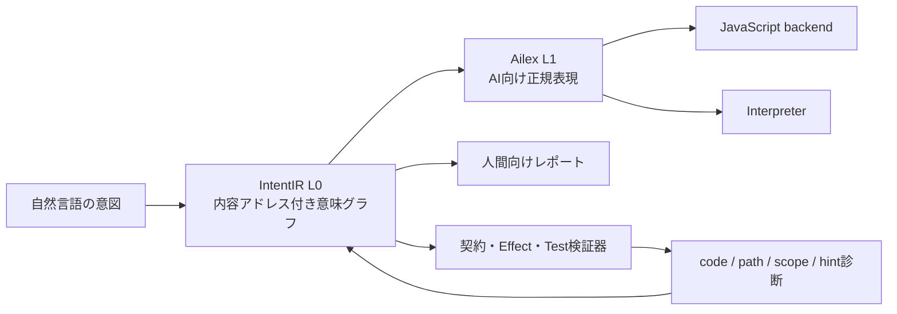

# Ailex 分析と改善版 AI 向け中間表現の提案

## 調査対象

- Repository: [oyasumiholiday/ailex](https://github.com/oyasumiholiday/ailex)
- Revision: [`095002e3e273b18e6211c2e8815bab0615d88fb1`](https://github.com/oyasumiholiday/ailex/commit/095002e3e273b18e6211c2e8815bab0615d88fb1)
- 調査日: 2026-07-13
- 実行環境: Node.js v24.15.0
- 実行結果: `npm test` は 89 / 89 成功

## 結論

Ailex の最も強い点は、AI向け言語の設計判断を実際のモデル生成実験で更新していることです。特に、スコープ開示、実行可能な `eg`、InterpreterとJavaScriptの二つの実行系、1ページのPrimerは、そのまま残す価値があります。

一方、現在のAilexは「AIが書きやすい小型の型付き言語」としては育っていますが、当初構想にある「内容アドレス付きL0グラフ」にはまだなっていません。実装の中心は名前付き関数のASTであり、意図・状態変化・検証義務・依存関係を直接操作する中間表現ではありません。

したがって、Ailexを捨てて別言語へ置き換えるより、次の二層に分ける案が良いと考えます。

1. AilexをAIが生成・修復しやすい実行言語または表層投影として使う
2. その下に、内容アドレス付きの意味グラフを「真実の表現」として置く

このワークスペースでは、2に相当する改善版をIntentIR v0.3として実装し、v0.4でCRUD実行とCLI、v0.5でKey/Unique、Repository Capability、SQLite永続化、v0.6でSchema SnapshotとMigration IR、v0.7でSQLite関係表投影、v0.8で型付き純粋Function、v0.9でAction内Function呼出しまで拡張しました。

## Ailex の強み

### 測定で言語を直している

ラムダ引数の型注釈とOptionに対する`map`について、モデルが自然に生成する形を観察し、言語側を修正して再測定しています。AI向け言語では、構文の美しさだけでなく、モデルの事前分布との相性を測る必要があります。Ailexはこの開発ループを実際に持っています。

### スコープ情報を診断へ含めている

未束縛名や型不一致の診断に、利用可能な名前と型を含めています。単なるエラー文よりも、次に選べる候補が分かる診断のほうがAIの修復に向いています。

### 実行可能な例を宣言の近くへ置いている

`eg`をドキュメントではなく実行対象にした判断は良いものです。仕様とテストの距離が短く、AIが関数単位で生成・検証しやすくなっています。

### 二つの実行系を同じ適合テストで確認している

InterpreterとJavaScript backendを同じ89件のテストで確認しています。変換器だけが誤る問題を検出する基礎があります。

### 限界や失敗した仮説も記録している

実験回数が少ないこと、Primer変更との交絡、新規性主張の下方修正などが明記されています。研究プロトタイプとして重要な姿勢です。

## 確認できた弱点

### 1. L0は内容アドレス付きグラフではなくAST

現行の`Program`は`fns: Fn[]`だけを持ち、式にはパース順の数値IDが付いています。[AST定義](https://github.com/oyasumiholiday/ailex/blob/095002e3e273b18e6211c2e8815bab0615d88fb1/core/lang.ts#L41)と[JavaScript loweringの説明](https://github.com/oyasumiholiday/ailex/blob/095002e3e273b18e6211c2e8815bab0615d88fb1/core/tojs.ts#L1)でも、L0は実質的にASTとして扱われています。

影響:

- 同じ意味の表現が同じIDになる保証がない
- 部分グラフの再利用やキャッシュができない
- 依存関係をASTの外から再解析する必要がある
- AIがノード単位の安全な差分を提案しにくい

### 2. `requires`は実行時に強制されない

型検査では`requires`をBoolとして確認しますが、関数呼び出し時の評価器は前提条件を確認しません。[型検査](https://github.com/oyasumiholiday/ailex/blob/095002e3e273b18e6211c2e8815bab0615d88fb1/core/lang.ts#L575)と[関数呼び出し評価](https://github.com/oyasumiholiday/ailex/blob/095002e3e273b18e6211c2e8815bab0615d88fb1/core/lang.ts#L607)を参照してください。

実際に、`requires x > 0`を持つ関数を`f(-1)`で呼ぶ`eg`は契約違反になりませんでした。

### 3. `ensures`は`eg`がある場合にしか実行されない

`runContracts`は`eg`だけを起点にし、その結果に対して`ensures`を確認します。[契約実行](https://github.com/oyasumiholiday/ailex/blob/095002e3e273b18e6211c2e8815bab0615d88fb1/core/lang.ts#L639)を参照してください。

そのため、`ensures ret > 0`を持ちながら`-1`を返す関数でも、`eg`がなければ`runContracts`は成功します。また、事後条件の実行環境には`ret`しか入らず、引数を参照する事後条件は正しく評価できません。

### 4. 文法上の予約語を値として検証していない

関数パーサは`fn`、`body`、`end`、終端の関数名について、トークン種別が`ident`であることしか確認していません。[関数パーサ](https://github.com/oyasumiholiday/ailex/blob/095002e3e273b18e6211c2e8815bab0615d88fb1/core/lang.ts#L127)を参照してください。

次のように予約語も終端名も誤った入力が受理され、formatterによって正しいAilexへ書き換えられることを再現しました。

```text
wat f (x : Int) -> Int nonsense Int x done wrong
```

これは寛容なパースではなく、誤入力の見逃しです。AIには誤りを局所的に返すほうが修復しやすくなります。

### 5. 不正な数値と式末尾が受理される

Lexerは数字と`.`の連続を数値として読み、`parseFloat`へ渡しています。[数値Lexer](https://github.com/oyasumiholiday/ailex/blob/095002e3e273b18e6211c2e8815bab0615d88fb1/core/lang.ts#L89)を参照してください。

- `1.2.3`はエラーではなく`1.2`になる
- `parseExpr("1 2")`は末尾の`2`を無視して`1`を返す

後者は[parseExpr](https://github.com/oyasumiholiday/ailex/blob/095002e3e273b18e6211c2e8815bab0615d88fb1/core/lang.ts#L217)がEOFを確認しないためです。

### 6. 重複定義が拒否されない

同名関数を二つ定義しても型検査は成功し、実行時のMapでは後の定義が前を上書きします。[グローバル値環境](https://github.com/oyasumiholiday/ailex/blob/095002e3e273b18e6211c2e8815bab0615d88fb1/core/lang.ts#L615)を参照してください。

AIが部分生成したコードを結合するとき、重複は起きやすいため、明示的な診断が必要です。

### 7. 診断位置がソース位置ではない

`type_mismatch.at`や`unknown_field.at`は行・列・範囲ではなく、パース中に増える式IDです。[診断型](https://github.com/oyasumiholiday/ailex/blob/095002e3e273b18e6211c2e8815bab0615d88fb1/core/lang.ts#L313)を参照してください。

前方へ式を追加するとIDが変わるため、AIが診断を受け取ってから編集する間の参照として弱くなります。最低でもsource span、より良くは内容ハッシュまたは構造Pathが必要です。

### 8. `scope`は任意位置のスコープ照会ではない

CLIの`scope`は、指定関数の引数、組み込み、全ユーザー関数を返しますが、`let`やラムダ内の任意位置は扱いません。[scopeList](https://github.com/oyasumiholiday/ailex/blob/095002e3e273b18e6211c2e8815bab0615d88fb1/core/cli.ts#L22)を参照してください。

AIの穴埋め生成に使うなら、ファイル・関数・式Pathまたはsource offsetを指定して、その地点で利用可能な値、型、Effect、未達義務を返す必要があります。

### 9. 適合テストは強いが、契約の境界ケースが不足している

89件が成功することは良い状態です。ただし、上記の`requires`未実行、`eg`なしの`ensures`、引数を参照する`ensures`、予約語の誤り、重複関数、不正数値、末尾トークンは適合テストで検出されていません。

二つのbackendが一致していても、共通の意味論が誤っていればテストは成功します。backend一致と仕様適合は別の軸で測る必要があります。

### 10. AI生成実験は有望だが、まだ一般化できない

16タスク、反復1回、限られたモデル、関数本体中心の評価です。この限界はAilex自身の実験ログにも記載されています。

次は、複数ファイル、既存コードの変更、状態、失敗する外部I/O、長い修復履歴を含む課題で測る必要があります。

## 改善案: Ailexを表層、意味グラフを中核にする



この構成では、Ailexの書きやすさと測定資産を失わず、名前付きテキストを中核データにする制約から離れられます。

## IntentIR v0.3から実装した改善

### 内容アドレス

Entity、Action、Test、Constraint、Effect、Edge、Obligationへ、正規化した意味内容のSHA-256を付けました。表層の同義表記や宣言順が変わっても、意味が同じなら同じIDを維持できます。

### シンボルとIDの分離

`action:CreateTask`のような人間向けシンボルと、`sha256:...`の不変IDを分けました。名前は参照しやすく、ハッシュは差分、キャッシュ、古い編集の検出に使えます。

### 完全に構造化された意味要素

- Requirement
- Effect
- Ensure
- Test callと引数
- Test expectationと比較対象
- Graph edge
- Verification obligation

これらを文字列ではなく、`kind`を持つデータ構造へ変換します。元の表層文字列は`source`として残しますが、意味IDの計算からは除外します。

### 実行検証

Testごとに空のStoreを作り、次の順序で検証します。

1. 事前条件
2. Effect
3. 事後条件
4. Test期待値

各確認結果には義務IDが付き、失敗した意味要素を直接特定できます。

### 構造化診断

診断は次の情報を持ちます。

- `code`: AIが分岐に使う安定コード
- `path`: 意味グラフ上の編集対象
- `scope`: 選択可能な名前や型
- `hint`: 次の修復候補
- `message` / `messageJa`: 人間向け説明

日本語レポートは英語メッセージの正規表現変換ではなく、この構造から直接生成します。

### 正直なbackend生成

v0.3では、未実装だった`update`と`delete`をコメントへ落として成功扱いせず、静的検証で拒否しました。v0.4では意味論、静的検証、Python実行器、TypeScript backendを揃えて実装したため、`insert / update / delete`を実行できます。

生成TypeScriptは、RequirementとEnsureを実行時に検査し、表層Testから`runIntentIRTests()`も生成します。

## IntentIR v0.4で追加した改善

### CRUDとトランザクション

`update Entity where field equals value set ...`と`delete Entity where field equals value`を構造化し、対象がちょうど1件の場合だけ実行します。Requirement、Effect、Ensureのすべてが成功した場合だけStoreを確定するため、失敗時に部分更新を残しません。

### 状態遷移を扱うTest

Testへ複数の`when`を記述し、作成、更新、削除を同じStore上で検証できます。存在、非存在、条件付き存在、件数を期待式として利用できます。

### 言語ツールの開発ループ

`check / test / run / build / fmt / report / ir`をサブコマンドとして実装しました。`run`はJSON Stateを読み書きでき、`build`はTypeScriptまたはグラフIRを生成します。

### backend間の実行確認

同じCRUDシナリオをPython実行器と生成TypeScriptの`runIntentIRTests()`で実行し、両方が成功するE2Eテストを追加しました。

## IntentIR v0.5で追加した改善

### 識別子と一意性

Fieldへ`key`または`unique`を宣言し、`update/delete`が一意なselectorを使うことを静的に検証します。State読込、Python実行器、生成TypeScriptの各段階でも一意制約を確認し、違反したActionは原子的に失敗します。

### Repository Capability

ActionのEffectから、対象Entityと`insert/update/delete`操作を持つRepository Capabilityを内容アドレス付きIRへ生成します。外部I/Oの必要性を、Action本体を再解析せず取得できる形にしました。

### SQLite State Repository

Moduleごとの正規化StateをSQLiteへ保存し、別プロセスのCLI実行間で状態を継続できます。読込から保存まではSQLiteトランザクションで保護し、Entity定義のStorage Schema Hashが一致しないDBは拒否します。

## IntentIR v0.6で追加した改善

### 内容アドレス付きMigration IR

SQLiteへ保存したSchema Snapshotと新しいIRを比較し、EntityとFieldの差分を構造化されたMigration操作へ変換します。Planと各操作には内容アドレスを付与し、同じ変更からは宣言順や実行時刻に依存しない同じIDを生成します。

### 変更の安全性分類

Migration操作を`safe / destructive / manual`へ分類します。Optional Field、Default付きField、空Entityの追加は自動適用でき、FieldやEntityの削除には明示的な`--allow-destructive`が必要です。型変更や値を補えない必須Field追加は`manual`として自動適用を拒否します。

### Transactional applyと旧DB互換

`intentir migrate`は既定でPlanだけを表示し、`--apply`が指定された場合だけState変換、対象Schemaでの再検証、Schema Snapshot更新を一つのSQLite Transactionで行います。v0.5 DBはSchema Hashが対象と一致するときに読込を継続し、次回保存時にSnapshotを補完します。

## IntentIR v0.7で追加した改善

### 決定的なSQLite関係表投影

Entityを専用Table、Fieldを型付きColumnへ投影し、物理Table名とProjection IDをModule/Entityの意味から決定的に生成します。`required`、default、Key/Unique、Boolean型などをSQLiteの`NOT NULL / DEFAULT / UNIQUE / CHECK`へ反映しました。

### 関係Stateを正本にするRepository

`relational-v1`ではJSON StateではなくEntity TableのRecordを正本として読込・保存します。Schema SnapshotとStorage Schema Hashはメタデータとして残し、意味Schemaと物理Projectionを別々の内容アドレスで追跡します。

### v0.5/v0.6 DBの段階的変換

旧JSON DBはそのまま読込でき、次の成功したAction保存またはMigration適用時に同じTransaction内で関係Tableへ変換します。Migration失敗時にはTable再構築もRollbackされます。

## IntentIR v0.8で追加した改善

### 型付き純粋Functionと一般式の第一段階

型付きInput、Return型、純粋式Body、実行可能Exampleを持つFunctionを追加しました。算術、比較、論理、条件式、Function呼出しを文字列ではなく構造化ASTとして保持し、BodyとExampleを内容アドレス付きNodeへ変換します。

### 呼出しGraphと終了性境界

Function間依存を`calls` Edgeとして生成し、未知変数、未知Function、引数不足・重複、型不一致を静的診断します。再帰は無制限に実行せず、終了性を表す検証義務が未実装であるためCycleとして拒否します。

### Python/TypeScriptの二重実行

`intentir call`で純粋Functionを直接実行でき、FunctionとExampleをTypeScriptへ生成します。ネスト呼出し、default、条件式を両backendで実行し、同じ5 Exampleが成功することを確認しました。

## IntentIR v0.9で追加した改善

### ActionとFunctionの意味Graph統合

Requirement、EffectのSelectorと代入値、Ensureで純粋Functionを利用できるようにしました。Action Inputを純粋式の変数Scopeとして型検証し、ActionからFunctionへの依存を`calls` Edgeとして内容アドレス付きGraphへ追加します。

### Backend間で共有する式意味論

Python実行器とTypeScript生成器が同じ純粋式ASTを評価します。式の型不一致は実行前に拒否し、ゼロ除算などのRuntime Errorが起きた場合もActionを原子的に失敗させます。

## 次の優先順位

### 1. Module/import

純粋Function、Entity、Actionを複数Moduleへ分割し、内容アドレス付きimportで接続します。import先の公開Symbolと依存Hashを固定し、同名衝突や循環importを静的に診断します。

### 2. Entity Relationと部分SQL更新

現在のRepositoryは関係Tableを正本にしますが、ActionごとにModule State全体を読み書きします。次はForeign Keyを持つRelation、Selectorから生成する部分SQL、Index生成へRepository Capabilityを接続します。

### 3. 明示Capabilityと外部I/O

Repositoryに続き、HTTP、File、Clock、Randomを型付きCapabilityとして表層から宣言し、テストでは決定的な代替実装を注入できるようにします。

### 4. 内容ハッシュを使うPatch IR

AIの編集をファイル全文ではなく、次のような操作として表します。

```json
{
  "op": "replace-node",
  "target": "sha256:old-node",
  "expectModule": "sha256:old-module",
  "value": {"kind": "action", "name": "CreateTask"}
}
```

古いModuleを前提にした編集を拒否できるため、並行編集や長いエージェント実行に向きます。

### 5. Holeと未達義務

未完成な式やActionを不正なテキストとして持たず、期待型、利用可能Scope、満たすべき契約を持つ`hole`ノードとして表します。

### 6. Ailexとの相互変換

IntentIRからAilexへの決定的投影と、AilexからIntentIRへのloweringを実装します。AilexのPrimerと生成実験を、そのまま意味グラフの評価へ接続できます。

### 7. 評価の拡張

- 新規作成だけでなく既存グラフの変更
- 小さな関数だけでなく複数Actionと状態遷移
- pass@1だけでなく修復回数、入力トークン、古いPatch率
- 強いモデルだけでなく小型ローカルモデル
- 表層Ailex生成と直接JSONグラフ生成の比較

## 最終提案

Ailexは「AIが書くプログラミング言語」として継続し、IntentIRは「AIとコンパイラが共有する意味データ」として分離するのが良い構成です。

競争点を新しい構文の発明に置くのではなく、次へ置きます。

- 同じ意味は同じIDになる
- 依存関係とEffectが明示される
- 未完成状態も型付きで保持できる
- 編集がハッシュ前提条件付きPatchになる
- すべての契約義務が実際に検証される
- 失敗時にPath、Scope、Hintが返る

この方向なら、Ailexで既に得られた「モデルの自然な生成に言語を合わせる」という強みと、真の中間表現に必要な構造的保証を両立できます。
